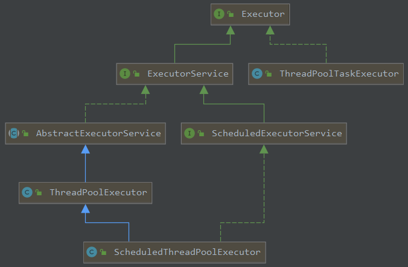

## Thread Class
### 背景
@Async的坑
1. 为每一个任务启动一个线程
2. 默认线程数不受限制
3. 不复用线程

### 线程池基础
#### 区分Executors，ThreadPoolExecutor和ThreadPoolTaskExecutor
 
1. Executors

工具类，相当于一个工厂类，实际调用ThreadPoolExecutor创建线程池。

- newSingleThreadExecutor：任务队列LinkedBlockingQueue默认长度为Integer.MAX_VALUE，占用内存
- newFixedThreadPool：任务队列LinkedBlockingQueue默认长度为Integer.MAX_VALUE，占用内存
- newCachedThreadPool：最大线程数为Integer.MAX_VALUE，队列为0
- newScheduledThreadPool：最大线程数为Integer.MAX_VALUE，延迟或定时任务

2. ThreadPoolExecutor

JDK中的类，ExecutorService为线程池接口，ScheduledExceutorService 线程调度接口

3. ThreadPoolTaskExecutor

Spring包下的类，实质是ThreadPoolExecutor的包装，通过XML自动注入或者配置类注入

- 方式一：
```
<bean id="taskExecutor" class="org.springframework.scheduling.concurrent.ThreadPoolTaskExecutor">
  <property name="corePoolSize" value="10"/>
  <property name="maxPoolSize" value="200"/>
  <property name="queueCapacity" value="10"/>
  <property name="keepAliveSeconds" value="20"/>
  <property name="rejectedExecutionHandler">
    <bean class="java.util.concurrent.ThreadPoolExecutor$CallerRunsPolicy"/>
  </property>
</bean>


@Resource(name="taskExecutor")
ThreadPoolTaskExecutor taskExecutor;
// 或者可以直接@Autowried
@AutoWired
ThreadPoolTaskExecutor taskExecutor
```

- 方式二：
```
@Configuration
public class ... {
    @Bean("taskExecutor")
    public Executor taskExecutor() {
        ThreadPoolTaskExecutor executor = new ThreadPoolTaskExecutor();
        //详见后文
    }
}
```

#### 处理流程
- 先核心线程，后入缓冲队列，最后最大线程
- 线程池中线程数大于核心线程数，在缓冲队列中的线程空闲时间超过设置，线程被销毁
- execute没有返回值，submit有返回值，通过future.get获取
- 拒绝策略
    -  AbortPolicy，默认，抛出异常可以捕获
    -  CallerRunPolicy，回退给调用者
    -  DiscardPolicy，抛弃任务
    -  DiscardOldPolicy，抛弃最旧任务 

### @Async
#### @Async使用
@Async的默认线程池为SimpleAsyncTaskExecutor，这个类不重用线程，默认每次调用都会创建一个新的线程。所以下面两种未自定义线程池**无法使用**。

1. 注解方式@EnableAsync
2. xml方式，Springboot中使用`@ImportResource(locations= {"classpath:static/spring.xml,..."})`引入xml
```xml
<task:annotation-driven/>
```

#### @Async自定义线程池

- 指定的为最高优先级
```java
@Component
public class Task {
    @Async("myExecutor")
    public void doSomething() {
        ...
    }
}
```

- AsyncConfigurer的默认线程池在源码中为空，否则作为默认线程池
- 其次，Spring通过beanFactory.getBean(TaskExecutor.class)查看是否有线程池，可以不指定线程池名称
```
ThreadPoolTaskExecutor->SchedulingTaskExecutor->AsyncTaskExecutor->TaskExecutor
```

- 最后，通过beanFactory.getBean(DEFAULT_TASK_EXECUTOR_BEAN_NAME, Executor.class)，查询名称为taskExecutor的线程池
```
ThreadPoolExecutorAdapter->ThreadPoolExecutor->AbstractExecutorService->ExecutorService->Executor
```

1. 重新实现AsyncConfigurer接口，有且只有一个

```java
@EnableAsync
@Configuration
public class MyConfigurer implements AsyncConfigurer {
    @Bean("myExecutor")
    public Executor taskExecutor() {
        ThreadPoolTaskExecutor executor = new ThreadPoolTaskExecutor();
        executor.setCorePoolSize(10);
        executor.setMaxPoolSize(20);
        executor.setQueueCapacity(200);
        executor.setKeepAliveSeconds(60);
        executor.setThreadNamePrefix("myExecutor-");
        executor.setRejectedExecutionHandler(new ThreadPoolExecutor.CallerRunsPolicy());
        executor.initialize();
        return executor;
    }
    @Override
    public Executor getAsyncExecutor() {
        return taskExecutor();
    }
    @Override
    public AsyncUncaughtExceptionHandler getAsyncUncaughtExceptionHandler() {
        return null;
    }
}
```
2. 修改XML
```xml
<task:annotation-driven executor="threadPool"/>
方式一
<bean id="threadPool"  class="org.springframework.scheduling.concurrent.ThreadPoolTaskExecutor">
  <property name="corePoolSize" value="5"/>
  ...
  <property name="rejectedExecutionHandler">
    <bean class="java.util.concurrent.ThreadPoolExecutor$CallerRunsPolicy" />
  </property>
</bean>
方式二
<task:executor id="threadPool" pool-size="5-10" queue-capacity="10" keep-alive="5" rejection-policy="DISCARD_OLDEST"/>
```

3. 继承AsyncConfigurerSupport
```java
@EnableAsync
@Configuration
class SpringAsyncConfigurer extends AsyncConfigurerSupport {  
    @Bean  
    public ThreadPoolTaskExecutor asyncExecutor() {  
        ThreadPoolTaskExecutor threadPool = new ThreadPoolTaskExecutor();
        ...
        return threadPool;  
    }  
  
    @Override  
    public Executor getAsyncExecutor() {  
        return asyncExecutor;  
}  

  @Override  
    public AsyncUncaughtExceptionHandler getAsyncUncaughtExceptionHandler() {
        return null;
    }
}
```

4. 配置自定义的TaskExecutor

```java
@EnableAsync
@Configuration
class TaskPoolConfig {  
    @Bean(name = AsyncExecutionAspectSupport.DEFAULT_TASK_EXECUTOR_BEAN_NAME) 
    public Executor taskExecutor() {  
        ThreadPoolTaskExecutor threadPool = new ThreadPoolTaskExecutor();
        ...
        return threadPool;  
    }  
```
#### @Async调用
1. 异步方法无返回值
2. 异步方法有返回值

```java
    @GetMapping("/test")
    public String test() throws Exception{
        LOGGER.info("aaa");
        Future<String> future = demoService.test();
        LOGGER.info("bbb");
        LOGGER.info(future.get()); //会阻塞住
        LOGGER.info("ccc");
        return "aaa";
    }
    
    @Async
    public Future<String> test() throws Exception{
        Thread.sleep(3000);
        Future<String> future = new AsyncResult<>("future");
        LOGGER.info("async");
        return future;
    }
```

#### @Async捕获异常
1. 返回值为void，异步方法中捕获异常处理或者`AsyncConfigurer`接口中`AsyncUncaughtExceptionHandler`处理异常

```java
    public AsyncUncaughtExceptionHandler getAsyncUncaughtExceptionHandler() {
        LOGGER.info("empty error"); // 应用线程池
        return new MyAsyncExceptionHandler();
    }
    // 内部类
    class MyAsyncExceptionHandler implements AsyncUncaughtExceptionHandler {
        @Override
        public void handleUncaughtException(Throwable throwable, Method method, Object... objects) {
            LOGGER.info(throwable.getMessage());
        }
    }
```
2. 返回值为Future，异步方法中捕获异常或者Future.get捕获异常