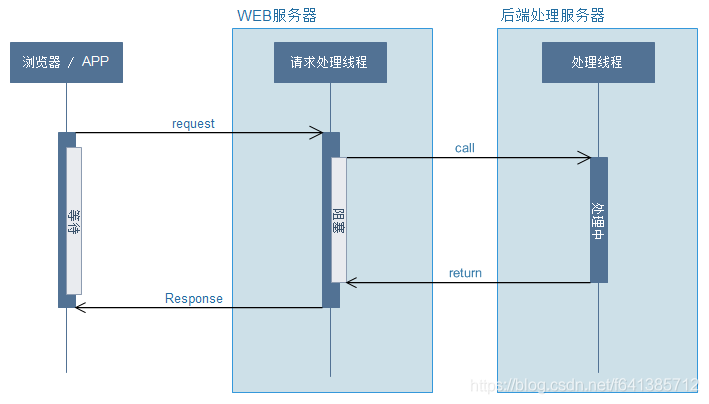
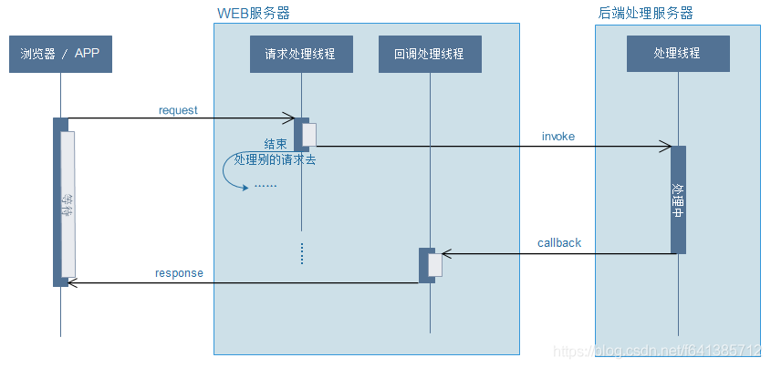

## Async Http
### 背景
异步请求与异步调用，本文为异步请求

- 两者的使用场景不同，异步请求用来解决并发请求对服务器造成的压力，从而提高对请求的吞吐量；而异步调用是用来做一些非主线流程且不需要实时计算和响应的任务，比如同步日志到kafka中做日志分析等。
- 异步请求是会一直等待response相应的，需要返回结果给客户端的；而异步调用我们往往会马上返回给客户端响应，完成这次整个的请求，至于异步调用的任务后台自己慢慢跑就行，客户端不会关心。

### 同步和异步请求


1. 请求发起者发起一个request，然后会一直等待一个response，这期间它是阻塞的
2. 请求处理线程会在call了之后等待return，自身处于**阻塞**状态
3. 然后都等待return，然后把response反给调用者就算全部结束了

Spring MVC3.2之后支持异步请求



1. 当Controller返回值是Callable的时候
2. Spring MVC调用`request.startAsync()`就会将Callable交给TaskExecutor去处理（一个隔离的线程池）
3. 与此同时将DispatcherServlet、Filter等等都马上退出主线程，但是response仍然保持打开的状态
4. Callable线程处理完成后，Spring MVC讲请求重新派发给容器
5. 根据Callabel返回结果，继续处理

### SpringBoot Http异步实现
Callable比DeferredResult简单，DeferredResult可在两个完全不相干的线程间的通信。

1. Servlet
```java
    @GetMapping("/testServlet")
    public void servletReq (HttpServletRequest request, HttpServletResponse response) throws InterruptedException {
        AsyncContext asyncContext = request.startAsync();
        asyncContext.addListener(new AsyncListener() {
            @Override
            public void onTimeout(AsyncEvent event) throws IOException {
                System.out.println("超时了...");
                //做一些超时后的相关操作...
            }
            @Override
            public void onStartAsync(AsyncEvent event) throws IOException {
                System.out.println("线程开始");
            }
            @Override
            public void onError(AsyncEvent event) throws IOException {
                System.out.println("发生错误："+event.getThrowable());
            }
            @Override
            public void onComplete(AsyncEvent event) throws IOException {
                System.out.println("执行完成");
                //这里可以做一些清理资源的操作...
            }
        });
        //设置超时时间
        asyncContext.setTimeout(20000);
        asyncContext.start(new Runnable() {
            @Override
            public void run() {
                try {
                    System.out.println("内部线程：" + Thread.currentThread().getName());
                    Thread.sleep(10000);
                    System.out.println("内部线程：" + Thread.currentThread().getName());
                    asyncContext.getResponse().setCharacterEncoding("utf-8");
                    asyncContext.getResponse().setContentType("text/html;charset=UTF-8");
                    asyncContext.getResponse().getWriter().println("这是异步的请求返回");
                } catch (Exception e) {
                    System.out.println("异常："+e);
                }
                //异步请求完成通知
                //此时整个请求才完成
                asyncContext.complete();
            }
        });
        System.out.println("主线程：" + Thread.currentThread().getName());
        //此时之类 request的线程连接已经释放了
        Thread.sleep(5000);
        System.out.println("主线程：" + Thread.currentThread().getName());
    }
```

2. Callable
默认线程池SimpleAsyncTaskExecutor，这个类不重用线程，默认每次调用都会创建一个新的线程。
```java
    @GetMapping("/testAsync")
    public Callable<String> testAsync() {
        LOGGER.info("main"); //此处还是容器线程
        Callable<String> data = new Callable<String>() {
            @Override
            public String call() throws Exception {
                Thread.sleep(2000);
                LOGGER.info("callable"); //此处已是SpringBoot线程
                return "callable data";
            }
        };
        return data;
    }
```

使用线程池
```java
@Configuration
public class WebMvcConfiguration implements WebMvcConfigurer {
    @Autowired
    @Qualifier("my")
    ThreadPoolTaskExecutor executor;
    
    public void configureAsyncSupport(AsyncSupportConfigurer configurer) {
        configurer.setTaskExecutor(executor);
//        configurer.setDefaultTimeout(60*1000);
//        configurer.registerCallableInterceptors(new TimeoutCallableProcessingInterceptor());//精细拦截器
//        configurer.registerDeferredResultInterceptors(new TimeoutDeferredResultProcessingInterceptor());//精细拦截器
    }
}
```

流程：

- 控制器返回Callable
- Spring调用request.startAsync()，将Callable 提交到TaskExecutor使用一个隔离的线程进行执行
- DispatcherServlet和所有的Filter退出web容器的线程，但是response保持打开状态
- Callable返回结果，SpringMVC将请求重新派发给容器，恢复之前的处理
- DispatcherServlet重新唤醒SpringMVC继续进行视图渲染流程等（从收请求-视图渲染）

3. WebAsyncTask

如果我们需要超时处理的回调或者错误处理的回调，我们可以使用WebAsyncTask代替Callable。
```java
    @GetMapping("/testWebAsync")
    public WebAsyncTask<String> testWebAsync() {
        LOGGER.info("main");
        Callable<String> callable = new Callable<String>() {
            @Override
            public String call() throws Exception {
                Thread.sleep(5000);
                LOGGER.info("callable");
                return "callable data";
            }
        };
        WebAsyncTask<String> webAsyncTask = new WebAsyncTask<>(1000, callable);
        webAsyncTask.onCompletion(() -> LOGGER.info("Complete")); //始终会打印，超时或错误结束会立刻打印
        webAsyncTask.onTimeout(() -> "timeout"); // 超时页面展示，线程被中断，不会打印callable
        webAsyncTask.onError(() -> "error"); // error页面展示
        return webAsyncTask;
    }
```

- WebAsyncTask.onCompletion(Runnable) ：在当前任务执行结束以后，无论是执行成功还是异常中止，onCompletion的回调最终都会被调用。
- 超时会被中断，不会打印callable
- 使用线程池

```java
@Autowired
@Qualifier("taskExecutor")
private ThreadPoolTaskExecutor executor;

@GetMapping("/threadPool")
public WebAsyncTask<String> asyncTaskThreadPool() {
    return new WebAsyncTask<>(10 * 1000L, executor,
            () -> {
                return "callable data";
            });
}
```

4. DeferredResult
```java
    @GetMapping("/testDefer")
    public DeferredResult<String> testDefer() {
        DeferredResult<String> deferredResult = new DeferredResult<>((long)30000, "timeout");
        //CompletableFuture.supplyAsync(demoService::execute).whenCompleteAsync((result, throwable) -> deferredResult.setResult(result)); //另一个线程set
        deferredResultList.add(deferredResult);
        return deferredResult;
    }
    @GetMapping("/testDeferTrigger")
    public void testDeferTrigger() {
        deferredResultList.forEach(d -> d.setResult("say hello to all"));//另一个线程set
    }
```

```java    
    public String execute() {
        try {
            Thread.sleep(5000);
            LOGGER.info("Slow task executed");
            return "say hello to all";
        } catch (InterruptedException e) {
            throw new RuntimeException();
        }
    }
```

流程：

- controller 返回一个DeferredResult，我们把它保存到内存里或者List里面（供后续访问）
- Spring MVC调用request.startAsync()，开启异步处理
- 与此同时将DispatcherServlet和Filter等等都马上退出主线程，但是response仍然保持打开的状态
- 应用通过另外一个线程（可能是MQ消息、定时任务等）给DeferredResult set值。然后Spring MVC会把这个请求再次派发给servlet容器
- DispatcherServlet再次被调用，然后处理后续的标准流程


### 异步拦截
`preHandle(主线程1)->main(主线程1)->afterConcurrentHandlingStarted(主线程1，异步开始)->callable->preHandle(主线程2)->postHandle(主线程2，异步拦截)->afterCompletion(主线程2)`

```java
@Component("AsyncInterceptor")
public class AsyncInterceptor implements AsyncHandlerInterceptor {
    private static final Logger LOGGER = LoggerFactory.getLogger(AsyncInterceptor.class);
    @Override
    public void afterConcurrentHandlingStarted(HttpServletRequest request, HttpServletResponse response, Object handler) throws Exception {
        LOGGER.info(Thread.currentThread().getName() + "---afterConcurrentHandlingStarted-->" + request.getRequestURI());
    }

    @Override
    public boolean preHandle(HttpServletRequest request, HttpServletResponse response, Object handler) throws Exception {
        LOGGER.info(Thread.currentThread().getName() + "---preHandle-->" + request.getRequestURI()+response.getOutputStream());
        return true;
    }

    @Override
    public void postHandle(HttpServletRequest request, HttpServletResponse response, Object handler, ModelAndView modelAndView) throws Exception {
        LOGGER.info(Thread.currentThread().getName() + "---postHandle-->" + request.getRequestURI());
    }

    @Override
    public void afterCompletion(HttpServletRequest request, HttpServletResponse response, Object handler, Exception ex) throws Exception {
        LOGGER.info(Thread.currentThread().getName() + "---afterCompletion-->" + request.getRequestURI());
    }
}
```
添加拦截器
```java
@Configuration
public class WebMvcConfiguration implements WebMvcConfigurer {
    @Autowired
    @Qualifier("my")
    ThreadPoolTaskExecutor executor;
    
    @Autowired
    @Qualifier("AsyncInterceptor")
    AsyncInterceptor asyncInterceptor;
    
    public void configureAsyncSupport(AsyncSupportConfigurer configurer) {
        configurer.setTaskExecutor(executor);
//        configurer.setDefaultTimeout(60*1000);
//        configurer.registerCallableInterceptors(new TimeoutCallableProcessingInterceptor());//精细拦截器
//        configurer.registerDeferredResultInterceptors(new TimeoutDeferredResultProcessingInterceptor());//精细拦截器
    }

    @Override
    public void addInterceptors(InterceptorRegistry registry) {
        InterceptorRegistration interceptor = registry.addInterceptor(asyncInterceptor);
        // 拦截所有、排除
        interceptor.addPathPatterns("/**")
                .excludePathPatterns("/user/login");
    }
}
```